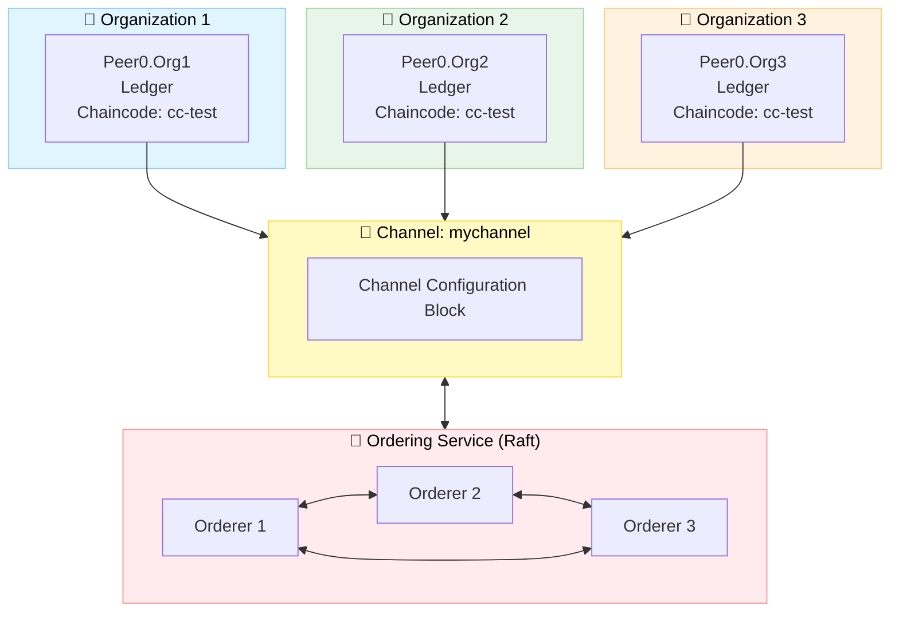

<div align="center">

# 🔗 Hyperledger Fabric Dynamic Network

### *A comprehensive permissioned blockchain network implementation with dynamic organization management, chaincode deployment and real-time event monitoring.*

[![fabric-logo]](https://hyperledger-fabric.readthedocs.io/)
[![docker-logo]](https://www.docker.com/)
[![shell-logo]](network/scripts/ "Bash scripts for network automation")
[![nodejs-logo]](https://nodejs.org/)
[![typescript-logo]](https://www.typescriptlang.org/)
[![license-logo]](LICENSE)

</div>

---

## 📋 Table of Contents

* [🚀 Getting Started](#-getting-started)
* [🧩 Project Overview](#-project-overview)
* [🌐 Network Module](#-network-module)
* [🧱 Chaincode Module](#-chaincode-module)
* [💻 Node.js Application Module](#-nodejs-application-module)
* [📚 Additional Resources](#-additional-resources)
* [📄 License](#-license)

---

## 🚀 Getting Started

### 🛠️ Prerequisites

To run this project, ensure that all the following dependencies are installed and available: 

| Tool | Version | Purpose |
|------|---------|---------|
| 🐳 [Docker](https://www.docker.com/) | Latest | Container runtime |
| 🟢 [Node.js](https://nodejs.org/) | 18+ | Application runtime |

### 📥 Installation

To get started with this project, first clone the repository to your local machine:

```bash
# Clone the repository
git clone https://github.com/wamuumu/hlf-events.git
cd hlf-events
```

### ⚡ Quick Start

To quickly set up and run the Hyperledger Fabric network, follow these steps:

1. **Install the Requirements**:
   ```bash
   cd network/scripts
   ./install-requirements.sh
   ```

2. **Package the Chaincode**:
   ```bash
   ./chaincode-package.sh
   ```

3. **Run the Test Networks**:
   ```bash
   # Run a test network with 3 organizations and 3 orderers
   ./test-3-orgs.sh 

   # Run a test network with 5 (3 + 2 dynamically added) organizations and 3 orderers
   ./test-5-orgs.sh
   ```
> [!TIP]  
> To better understand the basic setup, refer to the [Basic Setup](#-basic-setup) section.
   
> [!IMPORTANT]  
> This will create a ready-to-use local network with all the required components. To learn how to distribute the nodes and how to manage them, please refer to the instructions provided below.

---

## 🧩 Project Overview

This project consists of **three main components**, forming a complete blockchain testbed:

| Module             | Description                                                              | Folder       |
| ------------------ | ------------------------------------------------------------------------ | ------------ |
| 🌐 **Network**    | Complete Hyperledger Fabric network with dynamic organization management | `network/`   |
| 🧱 **Chaincode**   | Smart contract defining resource lifecycle operations                    | `chaincode/` |
| 💻 **Node.js App** | Event-driven TypeScript client for invoking and monitoring transactions  | `node-app/`  |

---

## 🌐 Network Module

### 📁 Folder Structure

```
network/
├── 📁 bin/                     # Hyperledger Fabric binaries
├── 📁 channel/                 # Generated channel artifacts
├── 📁 compose/                 # Docker Compose files
│   ├── docker-compose-ord1.yaml
│   ├── docker-compose-org1.yaml
│   └── ...
├── 📁 config/                  # Core configuration files
│   ├── core.yaml               # Peer configuration
│   └── orderer.yaml            # Orderer configuration
├── 📁 configtx/                # Channel configuration
│   ├── configtx.yaml            # Main channel config
│   └── 📁 org4/                # Dynamic org configs
├── 📁 crypto/                  # Crypto config templates
├── 📁 identities/              # Public certificates (shared)
├── 📁 organizations/           # Private keys (local only)
├── 📁 scripts/                 # Automation scripts
└── 📁 caliper/                 # Performance benchmarking
```

---

### ⚙️ Configuration

The (`network.config`) configuration file contains all the necessary variables for the network definition, including the Hyperledger Fabric settings and the default identity to use.

> [!TIP]  
> You can configure it according to your requirements.

```bash
# Fabric Version
FABRIC_VERSION="2.5.13"

# Network Identifiers
NETWORK_CHN_NAME="mychannel"
# Paths definitions ...

# Defaults variables
DEFAULT_ORG_DOMAIN="org1.tesbed.local"
DEFAULT_ORD="orderer.ord1.testbed.local"
DEFAULT_PEER_ID=1
DEFAULT_ENDPOINT="localhost"

# Chaincode Settings
CC_NAME="cc-test"
CC_SRC_LANG="javascript"
# Chaincode variables ...
```

---

### 🔧 Network Operations

> [!IMPORTANT]  
> All scripts related to network operations must be executed from the `network/scripts/` directory. Furthermore, please refer to the [Script Reference](#-script-reference) section for detailed information about each script and its parameters.

> [!NOTE]  
> In a production environment, network federated operations might be a little tricky since they often require strict cooperation and coordination among all the network members.

### 📦 Initial Network Setup

> [!IMPORTANT]  
> Before proceeding, a leader organization should be chosen, ensuring critical operations are executed only once.

#### Requirements Installation

```bash
# Install Hyperledger Fabric binaries and dependencies
cd network/scripts
./install-requirements.sh
```

> [!WARNING]  
> After the above operation, please ensure that Hyperledger Fabric binaries are available under the `network/bin` folder.

#### Cryptographic Material Generation

Each organization must generate its own credentials (private keys and public certificates) using the provided configuration files. This increases security by ensuring private keys are never shared, while public certificates are distributed via the shared `network/identities` folder.

```bash
# 1️⃣ Generate cryptographic material for each organization
./network-prep.sh <crypto-config-file> <docker-compose-file>
```
> [!IMPORTANT]  
> Crypto config files and docker compose files should be distributed by the **leader organization** and adjusted accordingly.

#### Genesis Block Generation

The leader organization is responsible for **generating** and **distributing** the genesis block. This block is saved under the `network/channel` directory and it is mainly used for channel creation and organization joining

```bash
# 2️⃣ Generate genesis block (leader only)
./network-init.sh
```

> [!DANGER]  
> In production environments, `network/identities` and `network/channel` directories must be shared among all organizations.

#### Containers startup and channel joining

After all organizations have generated their credentials and the genesis block has been distributed, each organization can start its Docker containers and join the channel.

```bash
# 3️⃣ Start Docker containers
./docker-up.sh <docker-compose-file>

# 4️⃣ Join orderers and organizations to the channel

# If this is an orderer organization:
./network-join-orderer.sh <orderer-hostname>

# If this is a regular organization:
./network-join-organization.sh <org-domain>
```

> [!TIP]  
> Orderers and peers have different roles: **peers** execute smart contracts, maintain a copy of the channel ledger and host the world state, while **orderers** are responsible for ordering transactions into blocks and ensuring consistency across the network.

### 🔑 Chaincode Lifecycle

The chaincode defines the business logic of the blockchain application that runs on the peer nodes. 

#### Chaincode Installation

Chaincode source code and metadata are bundled into a single file, typically a tarball, with a unique **package ID**. This package is the deployable unit that gets installed on the peers of each organization.

```bash
# 1️⃣ Package the chaincode 
./chaincode-package.sh

# 2️⃣ Install chaincode on organization's peers
./chaincode-install.sh <org-domain>
```

#### Chaincode Approval

Once the chaincode is installed, each organization must formally approve its definition (e.g. name, version and endorsement policies) for the channel. This ensures that all the members of the federation agree on the same chaincode.

```bash
# 3️⃣ Approve chaincode (each organization)
./chaincode-approve.sh <org-domain>
```

> [!IMPORTANT]  
> For this project, in order to reach consensus, all the organizations must approve the chaincode definition.

#### Chaincode Commitment

After all organizations have approved the chaincode, it can be **committed** to the channel. This makes the chaincode active and ready to execute invoke and query transactions.

```bash
# 4️⃣ Commit chaincode to channel (only once)
./chaincode-commit.sh <org-domain>

# 5️⃣ Test chaincode operations (optional)
./chaincode-invoke.sh <org-domain> <peer-id>
./chaincode-query.sh <org-domain> <peer-id>
```

### 🔄 Dynamic Organization Management

The network supports dynamic addition and removal of organizations without requiring a complete network restart. This is achieved through configuration updates and channel reconfiguration.

#### Adding a New Organization

> [!NOTE]  
> In the following example, the [Basic Setup](#-basic-setup) with 3 organizations is extended by adding a 4th organization (`org4.testbed.local`).

Initially, the new organization must generate its cryptographic material and start its Docker containers, as the other organizations did during the initial setup. Its public certificates must also be shared via the `network/identities` folder.

```bash
# 1️⃣ Org 4: Generate credentials
./network-prep.sh crypto-config-org4.yaml docker-compose-org4.yaml

# 2️⃣ Org 4: Start containers
./docker-up.sh docker-compose-org4.yaml
```

Then, an existing organization (e.g. `org1.testbed.local`) must generate a join request to add the new organization to the channel. This request is saved as a configuration update proposal in the file `org4_update_in_envelope.pb`, located by default under the shared `network/channel` directory. All existing network members must approve this proposal before it can be committed and the new organization becomes an official channel member.

```bash
# 3️⃣ Existing org (e.g. org1.testbed.local): Create join request
./network-join-request.sh configtx-org4.yaml org1.testbed.local

# 4️⃣ All orgs: Approve join request
./network-approve-update.sh org4_update_in_envelope.pb org1.testbed.local
./network-approve-update.sh org4_update_in_envelope.pb org2.testbed.local
./network-approve-update.sh org4_update_in_envelope.pb org3.testbed.local

# 5️⃣ Existing org (e.g. org1.testbed.local): Commit update
./network-commit-update.sh org4_update_in_envelope.pb org1.testbed.local
```

At this point, the new organization has been successfully added to the channel. As with the existing members, it can now have its peer/s join the channel and set its anchor peer.

The **anchor peer** allows peer discovery and cross-organization communication within the channel via the gossip protocol.

> [!NOTE]  
> This step is required now because the new organization was not part of the channel when the original members set their anchor peers.

```bash
# 6️⃣ Org 4: Join channel and set anchor peer
./network-join-organization.sh org4.testbed.local
./network-set-anchor-peer.sh org4.testbed.local 1
```

Finally, the chaincode must be installed on the new organization’s peer/s, approved and then committed once again on the channel.

> [!DANGER]  
> After the new organization has joined the channel, all the federation members must approve the chaincode definition again to include the new member.

```bash
# 7️⃣ Org 4: Install the chaincode
./chaincode-install.sh org4.testbed.local

# All orgs (including org4): Approve the chaincode again
./chaincode-approve.sh org1.testbed.local 
./chaincode-approve.sh org2.testbed.local 
./chaincode-approve.sh org3.testbed.local 
./chaincode-approve.sh org4.testbed.local 

# Existing org: Commit the chaincode again (only once)
./chaincode-commit.sh org1.testbed.local 
```

#### Removing an Existing Organization

As for adding a new organization, the removal process is almost the same, but in reverse order. An existing organization (e.g. `org1.testbed.local`) must create a leave request for the organization to be removed (e.g. `org4.testbed.local`). This request must then be approved by the majority of the other members before it can be committed.

```bash
# 1️⃣ Create leave request
./network-leave-request.sh configtx-org4.yaml org1.testbed.local

# 2️⃣ Approve removal (majority required)
./network-approve-update.sh org4_update_in_envelope.pb org1.testbed.local
./network-approve-update.sh org4_update_in_envelope.pb org2.testbed.local
./network-approve-update.sh org4_update_in_envelope.pb org3.testbed.local

# 3️⃣ Commit removal
./network-commit-update.sh org4_update_in_envelope.pb org1.testbed.local

# 4️⃣ Leaving org: Clean up credentials and stop containers
./network-leave-organization.sh org4.testbed.local --hard
./docker-down.sh docker-compose-org4.yaml
```

---

### 📜 Script Reference

| Script | Description | Parameters | Example |
|---------|--------------|-------------|----------|
| `install-requirements.sh` | Installs Hyperledger Fabric binaries and dependencies. | *(none)* | `./install-requirements.sh` |
| `network-prep.sh` | Generates the private credentials and create/add the public identity to the shared folder. | `<crypto-config.yaml>` `<docker-compose.yaml>` | `./network-prep.sh crypto-config-org1.yaml docker-compose-org1.yaml` |
| `network-init.sh` | Creates the genesis block (leader org only). | *(none)* | `./network-init.sh` |
| `docker-up.sh` | Starts network containers defined in the given compose file. | `<docker-compose.yaml>` | `./docker-up.sh docker-compose-org1.yaml` |
| `docker-down.sh` | Stops and removes containers for the given organization. If the optional `--hard` flag is provided, it also prunes volumes and removes orphaned containers. | `<docker-compose.yaml>` `[--hard]` | `./docker-down.sh docker-compose-org1.yaml`<br>`./docker-down.sh docker-compose-org1.yaml --hard` |
| `network-join-orderer.sh` | Joins an orderer organization to the channel. | `<orderer-hostname>` | `./network-join-orderer.sh orderer.ord1.testbed.local` |
| `network-join-organization.sh` | Joins a peer organization to the channel. | `<org-domain>` | `./network-join-organization.sh org1.testbed.local` |
| `network-set-anchor-peer.sh` | Sets the anchor peer for the given organization. | `<org-domain>` `<peer-id>` | `./network-set-anchor-peer.sh org1.testbed.local 1` |
| `chaincode-package.sh` | Packages the chaincode source into a deployable tarball. | *(none)* | `./chaincode-package.sh` |
| `chaincode-install.sh` | Installs the packaged chaincode on an organization’s peer(s). | `<org-domain>` | `./chaincode-install.sh org1.testbed.local` |
| `chaincode-approve.sh` | Approves the chaincode definition for an organization. | `<org-domain>` | `./chaincode-approve.sh org1.testbed.local` |
| `chaincode-commit.sh` | Commits the chaincode definition to the channel. | `<org-domain>` | `./chaincode-commit.sh org1.testbed.local` |
| `chaincode-invoke.sh` | Executes a transaction (invoke) on the chaincode. **For testing only.** | `<org-domain>` `<peer-id>` | `./chaincode-invoke.sh org1.testbed.local 1` |
| `chaincode-query.sh`  | Queries the chaincode state. **For testing only.** | `<org-domain>` `<peer-id>` | `./chaincode-query.sh org1.testbed.local 1` |
| `network-join-request.sh` | Creates a join request proposal to add a new organization. | `<configtx.yaml>` `<requester-org>` | `./network-join-request.sh configtx-org4.yaml org1.testbed.local` |
| `network-approve-update.sh` | Approves a pending channel update. | `<proposal-file>` `<org-domain>` | `./network-approve-update.sh org4_update_in_envelope.pb org2.testbed.local` |
| `network-commit-update.sh` | Commits a channel update after approvals. | `<proposal-file>` `<org-domain>` | `./network-commit-update.sh org4_update_in_envelope.pb org1.testbed.local` |
| `network-leave-request.sh` | Creates a request to remove an organization from the channel. | `<configtx.yaml>` `<requester-org>` | `./network-leave-request.sh configtx-org4.yaml org1.testbed.local` |
| `network-leave-organization.sh` | Removes the organization public identity from the shared folder. If the optional `--hard` flag is provided, it also deletes the local private credentials. | `<org-domain>` `[--hard]` | `./network-leave-organization.sh org4.testbed.local --hard` |

> [!NOTE]  
> Identity parameters (i.e. `<org-domain>`, `<orderer-hostname>`) are used to differentiate between the various members in a local development setup. In a production environment, these should be removed, as the scripts should understand the identity from the environment / configuration files (e.g. `network.config`)

---

### 🏗️ Basic Setup

* **3 Ordering Nodes** (`Raft consensus`)
* **3 Peer Organizations** (`1 Peer each`)
* **1 Application Channel** (`mychannel`)
* **1 Deployed Chaincode** (`cc-test`)

```bash
# Setup a ready-to-use network with 3 organizations and 3 orderers
./test-3-orgs.sh
```


---

### 🛡️ Security Considerations

- 🔐 **Private keys** are stored locally in the `network/organizations` directory (never shared)
- 📜 **Public certificates** are shared via the `network/identities` folder (ensure trust)
- 🔏 **TLS enabled** for all communications
- ✍️ **Digital signatures** are used for identity verification. For each operation, a challenge is created to test if there is a match between the private credentials and the shared public certificate (useful in local development setups)
- 🎫 **MSP-based** access control

---

### 📊 Performance Testing

Integrated [Hyperledger Caliper](https://hyperledger.github.io/caliper/) for comprehensive benchmarking.

#### Available Benchmarks

| Benchmark | Focus | Configuration |
|-----------|-------|---------------|
| **Throughput** | Maximum TPS | 4 workers, 60s duration |
| **Latency** | Response time | 1 worker, low TPS |
| **Success Ratio** | Transaction reliability | 2 workers, mixed load |
| **Resource Usage** | CPU/Memory/Network | Docker monitoring |

#### Running the Benchmarks

```bash
cd network/caliper

# Configure network connection
cp networks/network-config.template.yaml networks/network-config.yaml
# Edit network-config.yaml with your organization credentials

# Run a benchmark
./run-benchmark.sh \
    networks/network-config.yaml \
    benchmarks/throughput.yaml

# Results are saved in ./results/
```

#### Sample Output

```
+----------------+--------+--------+--------+--------+--------+--------+
| Name           | Succ   | Fail   | Send   | Latency| Latency| Through|
|                |        |        | Rate   | (avg)  | (max)  | put    |
+----------------+--------+--------+--------+--------+--------+--------+
| tx-throughput  | 6000   | 0      | 100.0  | 0.045  | 0.892  | 99.8   |
| query-through. | 12000  | 0      | 200.0  | 0.012  | 0.234  | 199.6  |
+----------------+--------+--------+--------+--------+--------+--------+
```

---

## 🧱 Chaincode Module

### 📁 Folder Structure

```
chaincode/
└── 📁 cc-test/                  # Chaincode folder
    ├── 📁 lib/                  # Business logic and data model definitions
    │   └── resource.js          # Chaincode source code
    ├── index.js                 # Entry point registering the smart contract
    └── package.json             # Chaincode dependencies and metadata
```

---

### 📜 Resource Events Contract

| Function | Type | Description |
|----------|------|-------------|
| `CreateResource` | Submit | Creates a new resource on the ledger |
| `ReadResource` | Evaluate | Retrieves a resource by ID |
| `ReadAllResources` | Evaluate | Returns all resources |

### 🗂️ Resource Schema

```javascript
{
    PID: string,           // Unique identifier
    URI: string,           // Resource location
    hash: string,          // Content hash
    timestamp: string,     // Creation time
    owners: string[]       // List of owner identifiers
}
```

## 💻 Node.js Application Module

Event-driven TypeScript application for interacting with the network.

### 📁 Folder Structure

```
node-app/
├── 📁 config/                  # Connection profiles and environment templates
│   └── connection-org1.json    # Example network connection configuration
├── 📁 src/                     # TypeScript application source code
│   ├── app.ts                  # Main entry point (application bootstrap)
│   ├── connect.ts              # ConnectionManager: gateway and connection management
│   ├── contract.ts             # ContractManager: submit/evaluate transactions
│   └── listener.ts             # EventManager: listens to chaincode and block events
├── package.json                # Project dependencies, scripts and metadata
└── tsconfig.json               # TypeScript compiler configuration

```

### ⚙️ Setup

```bash
cd node-app

# Install dependencies
npm install

# Configure environment
cp .env.example .env
# Edit .env with your settings

# Build and run
npm run build
npm start
```

### 🏛️ Application Architecture

```typescript
// Key Components
ConnectionManager (connect.ts)   →   Manages gateway connections
EventManager (listener.ts)       →   Listens to chaincode events
ContractManager (contract.ts)    →   Submits transactions
```

### ✨ Features

- ✅ **Automatic connection management** with retry logic
- ✅ **Real-time event streaming** from chaincode
- ✅ **Type-safe contract interactions**
- ✅ **Graceful shutdown handling**

### 📌 Example Usage

```typescript
// In app.ts (main)

// Create a resource
const resource = await contractManager.createResource([
    'pid_123',
    'https://example.com/resource',
    'hash_value',
    '1234567890',
    JSON.stringify(['owner1', 'owner2'])
]);

// Event automatically emitted and logged:
// <-- [CHAINCODE] Chaincode event received: CreateResource
```

---

## 🙏 Acknowledgments

A big shoutout to the projects below for their awesome work and open-source contributions:

<div style="display: flex; align-items: left;">
    <a href="https://github.com/hyperledger/fabric">
        
    </a>
    <a href="https://github.com/hyperledger-caliper/caliper">
        
    </a>
    <a href="https://shields.io/">
        
    </a>
    <a href="https://simpleicons.org/">
        
    </a>
</div>

---

## 📚 Additional Resources

- 📖 [Hyperledger Fabric Documentation](https://hyperledger-fabric.readthedocs.io/)
- 🔧 [Fabric Gateway SDK](https://hyperledger.github.io/fabric-gateway/)

---

## 📄 License

[![license-logo]](LICENSE)

<div align="right">

[](#top)

</div>

<!-- LOGOs -->
[fabric-logo]: https://img.shields.io/badge/Hyperledger%20Fabric-2.5.13-orange?style=for-the-badge
[shell-logo]: https://img.shields.io/badge/Shell-Bash-4EAA25?style=for-the-badge&logo=gnu-bash
[nodejs-logo]: https://img.shields.io/badge/Node.js-18+-green?style=for-the-badge&logo=node.js
[docker-logo]: https://img.shields.io/badge/Docker-Latest-2496ED?style=for-the-badge&logo=docker
[typescript-logo]: https://img.shields.io/badge/TypeScript-5.4-3178C6?style=for-the-badge&logo=typescript
[license-logo]: https://img.shields.io/badge/License-GPL%20v3-yellow?style=for-the-badge

