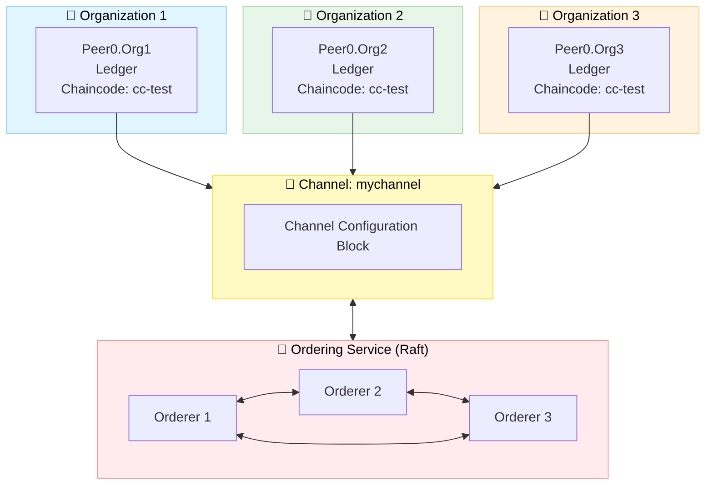

<div align="center">

# 🔗 Hyperledger Fabric Dynamic Network

### *A comprehensive permissioned blockchain network implementation with dynamic organization management, chaincode deployment and real-time event monitoring.*

[](https://www.hyperledger.org/use/fabric)
[](https://nodejs.org/)
[](https://www.docker.com/)
[](https://www.typescriptlang.org/)
[](LICENSE)

</div>

---

## 📋 Table of Contents

* [🚀 Getting Started](#-getting-started)
* [🧩 Project Overview](#-project-overview)
  * [🌐 Network Module](#-network-module)
  * [🧱 Chaincode Module](#-chaincode-module)
  * [💻 Node.js Application Module](#-nodejs-application-module)
* [📚 Additional Resources](#-additional-resources)
* [📄 License](#-license)

---

## 🚀 Getting Started

### Prerequisites

To run this project, ensure that all the following dependencies are installed and available: 

| Tool | Version | Purpose |
|------|---------|---------|
| 🐳 [Docker](https://www.docker.com/) | Latest | Container runtime |
| 📦 [Node.js](https://nodejs.org/) | 18+ | Application runtime |

### Installation

To get started with this project, first clone the repository to your local machine:

```bash
# Clone the repository
git clone https://github.com/wamuumu/hlf-events.git
cd hlf-events
```

---

## 🧩 Project Overview

This project consists of **three main components**, forming a complete blockchain testbed:

| Module             | Description                                                              | Folder       |
| ------------------ | ------------------------------------------------------------------------ | ------------ |
| 🌐 **Network**    | Complete Hyperledger Fabric network with dynamic organization management | `network/`   |
| 🧱 **Chaincode**   | Smart contract defining resource lifecycle operations                    | `chaincode/` |
| 💻 **Node.js App** | Event-driven TypeScript client for invoking and monitoring transactions  | `node-app/`  |

---

## 🌐 Network Module

### 📁 Folder Structure

```
network/
├── 📁 bin/                    # Hyperledger Fabric binaries
├── 📁 channel/                # Generated channel artifacts
├── 📁 compose/                # Docker Compose files
│   ├── docker-compose-ord1.yaml
│   ├── docker-compose-org1.yaml
│   └── ...
├── 📁 config/                 # Core configuration files
│   ├── core.yaml             # Peer configuration
│   └── orderer.yaml          # Orderer configuration
├── 📁 configtx/              # Channel configuration
│   ├── configtx.yaml         # Main channel config
│   └── org4/                 # Dynamic org configs
├── 📁 crypto/                # Crypto config templates
├── 📁 identities/            # Public certificates (shared)
├── 📁 organizations/         # Private keys (local only)
├── 📁 scripts/               # Automation scripts
└── 📁 caliper/               # Performance benchmarking
```

---

### ⚙️ Configuration

### Network Configuration (`network.config`)

 This configuration file contains all the necessary variables for the network definition, including the Hyperledger Fabric settings and the default identity to use.

```bash
# Fabric Version
FABRIC_VERSION="2.5.13"

# Network Identifiers
NETWORK_CHN_NAME="mychannel"
# Paths definitions ...

# Defaults variables
DEFAULT_ORG_DOMAIN="org1.tesbed.local"
DEFAULT_ORD="orderer.ord1.testbed.local"
DEFAULT_PEER_ID=1
DEFAULT_ENDPOINT="localhost"

# Chaincode Settings
CC_NAME="cc-test"
CC_SRC_LANG="javascript"
# Chaincode variables ...
```

---

## 🔧 Network Operations

> [!IMPORTANT]  
> All scripts related to network operations must be executed from the `network/scripts/` directory.

### Initial Network Setup

> [!NOTE]  
> In production, the initial setup might be a little tricky since it requires strict cooperation and coordination among all the initial members of the network. 

> [!IMPORTANT]  
> Before proceeeding, a leader organization should be chosen, ensuring critical operations are executed only once.

```bash
# Install Hyperledger Fabric binaries and dependencies
cd network/scripts
./install-requirements.sh

# 1️⃣ Generate cryptographic material for each organization
./network-prep.sh <crypto-config-file> <docker-compose-file>

# 2️⃣ Generate genesis block (leader only)
./network-init.sh

# 3️⃣ Start Docker containers
./docker-up.sh <docker-compose-file>

# 4️⃣ Join orderers and organizations to the channel
./network-join-orderer.sh <orderer-hostname>
./network-join-organization.sh <org-domain>
```

### Chaincode Lifecycle

```bash
# 1️⃣ Package the chaincode 
./chaincode-package.sh

# 2️⃣ Install chaincode on organization's peers
./chaincode-install.sh <org-domain>

# 3️⃣ Approve chaincode (each organization)
./chaincode-approve.sh <org-domain>

# 4️⃣ Commit chaincode to channel (only once)
./chaincode-commit.sh <org-domain>

# 5️⃣ Test chaincode operations (optional)
./chaincode-invoke.sh <org-domain> <peer-id>
./chaincode-query.sh <org-domain> <peer-id>
```

### 🔄 Dynamic Organization Management

#### Adding a New Organization

```bash
# 1️⃣ New org: Generate credentials
./network-prep.sh crypto-config-org4.yaml docker-compose-org4.yaml

# 2️⃣ New org: Start containers
./docker-up.sh docker-compose-org4.yaml

# 3️⃣ Existing org: Create join request
./network-join-request.sh configtx-org4.yaml org1.testbed.local

# 4️⃣ All orgs: Approve join request
./network-approve-update.sh org4_update_in_envelope.pb org1.testbed.local
./network-approve-update.sh org4_update_in_envelope.pb org2.testbed.local

# 5️⃣ Any org: Commit update
./network-commit-update.sh org4_update_in_envelope.pb org1.testbed.local

# 6️⃣ New org: Join channel and set anchor peer
./network-join-organization.sh org4.testbed.local
./network-set-anchor-peer.sh org4.testbed.local 1

# 7️⃣ Install and approve chaincode
./chaincode-install.sh org4.testbed.local
./chaincode-approve.sh org4.testbed.local  # All orgs must approve
./chaincode-commit.sh org1.testbed.local   # Once
```

#### Removing an Organization

```bash
# 1️⃣ Create leave request
./network-leave-request.sh configtx-org4.yaml org4.testbed.local

# 2️⃣ Approve removal (majority required)
./network-approve-update.sh org4_update_in_envelope.pb org1.testbed.local
./network-approve-update.sh org4_update_in_envelope.pb org2.testbed.local

# 3️⃣ Commit removal
./network-commit-update.sh org4_update_in_envelope.pb org1.testbed.local

# 4️⃣ Leaving org: Clean up
./network-leave-organization.sh org4.testbed.local --hard
./docker-down.sh docker-compose-org4.yaml
```

### Test the network with basic setup

* **3 Ordering Nodes** (`Raft consensus`)
* **3 Peer Organizations**
* **1 Application Channel** (`mychannel`)
* **1 Deployed Chaincode** (`cc-test`)

```bash
# Setup a ready-to-use network with 3 organizations and 3 orderers
./test-3-orgs.sh
```


---

## 🛡️ Security Considerations

- 🔐 **Private keys** stored locally in `organizations/` (never shared)
- 📜 **Public certificates** shared via `identities/` folder (trust)
- 🔏 **TLS enabled** for all communications
- ✍️ **Digital signatures** for identity verification
- 🎫 **MSP-based** access control

---

## 📊 Performance Testing

Integrated [Hyperledger Caliper](https://hyperledger.github.io/caliper/) for comprehensive benchmarking.

### Available Benchmarks

| Benchmark | Focus | Configuration |
|-----------|-------|---------------|
| **Throughput** | Maximum TPS | 4 workers, 60s duration |
| **Latency** | Response time | 1 worker, low TPS |
| **Success Ratio** | Transaction reliability | 2 workers, mixed load |
| **Resource Usage** | CPU/Memory/Network | Docker monitoring |

### Running Benchmarks

```bash
cd network/caliper

# Configure network connection
cp networks/network-config.template.yaml networks/network-config.yaml
# Edit network-config.yaml with your organization credentials

# Run a benchmark
./run-benchmark.sh \
    networks/network-config.yaml \
    benchmarks/throughput.yaml

# Results are saved in ./results/
```

### Sample Output

```
+----------------+--------+--------+--------+--------+--------+--------+
| Name           | Succ   | Fail   | Send   | Latency| Latency| Through|
|                |        |        | Rate   | (avg)  | (max)  | put    |
+----------------+--------+--------+--------+--------+--------+--------+
| tx-throughput  | 6000   | 0      | 100.0  | 0.045  | 0.892  | 99.8   |
| query-through. | 12000  | 0      | 200.0  | 0.012  | 0.234  | 199.6  |
+----------------+--------+--------+--------+--------+--------+--------+
```

---

## 🧱 Chaincode Module

### 📁 Folder Structure

```
chaincode/
└── 📁 cc-test/                  # Chaincode folder
    ├── 📁 lib/                  # Business logic and data model definitions
    │   └── resource.js          # Chaincode source code
    ├── index.js                 # Entry point registering the smart contract
    └── package.json             # Chaincode dependencies and metadata
```

---

### Resource Events Contract

| Function | Type | Description |
|----------|------|-------------|
| `CreateResource` | Submit | Creates a new resource on the ledger |
| `ReadResource` | Evaluate | Retrieves a resource by ID |
| `ReadAllResources` | Evaluate | Returns all resources |

### Resource Schema

```javascript
{
    PID: string,           // Unique identifier
    URI: string,           // Resource location
    hash: string,          // Content hash
    timestamp: string,     // Creation time
    owners: string[]       // List of owner identifiers
}
```

## 💻 Node.js Application Module

Event-driven TypeScript application for interacting with the network.

### 📁 Folder Structure

```
node-app/
├── 📁 config/                  # Connection profiles and environment templates
│   └── connection-org1.json    # Example network connection configuration
├── 📁 src/                     # TypeScript application source code
│   ├── app.ts                  # Main entry point (application bootstrap)
│   ├── connect.ts              # ConnectionManager: gateway and connection management
│   ├── contract.ts             # ContractManager: submit/evaluate transactions
│   └── listener.ts             # EventManager: listens to chaincode and block events
├── package.json                # Project dependencies, scripts and metadata
└── tsconfig.json               # TypeScript compiler configuration

```

### Setup

```bash
cd node-app

# Install dependencies
npm install

# Configure environment
cp .env.example .env
# Edit .env with your settings

# Build and run
npm run build
npm start
```

### Application Architecture

```typescript
// Key Components
ConnectionManager (connect.ts)   →   Manages gateway connections
EventManager (listener.ts)       →   Listens to chaincode events
ContractManager (contract.ts)    →   Submits transactions
```

### Features

- ✅ **Automatic connection management** with retry logic
- ✅ **Real-time event streaming** from chaincode
- ✅ **Type-safe contract interactions**
- ✅ **Graceful shutdown handling**

### Example Usage

```typescript
// In app.ts (main)

// Create a resource
const resource = await contractManager.createResource([
    'pid_123',
    'https://example.com/resource',
    'hash_value',
    '1234567890',
    JSON.stringify(['owner1', 'owner2'])
]);

// Event automatically emitted and logged:
// <-- [CHAINCODE] Chaincode event received: CreateResource
```

---

## 📚 Additional Resources

- 📖 [Hyperledger Fabric Documentation](https://hyperledger-fabric.readthedocs.io/)
- 🔧 [Fabric Gateway SDK](https://hyperledger.github.io/fabric-gateway/)
- 📊 [Hyperledger Caliper](https://hyperledger.github.io/caliper/)

---

## 📄 License

Released under the [GNU](LICENSE) license.

<div align="left">

[](#top)

</div>

