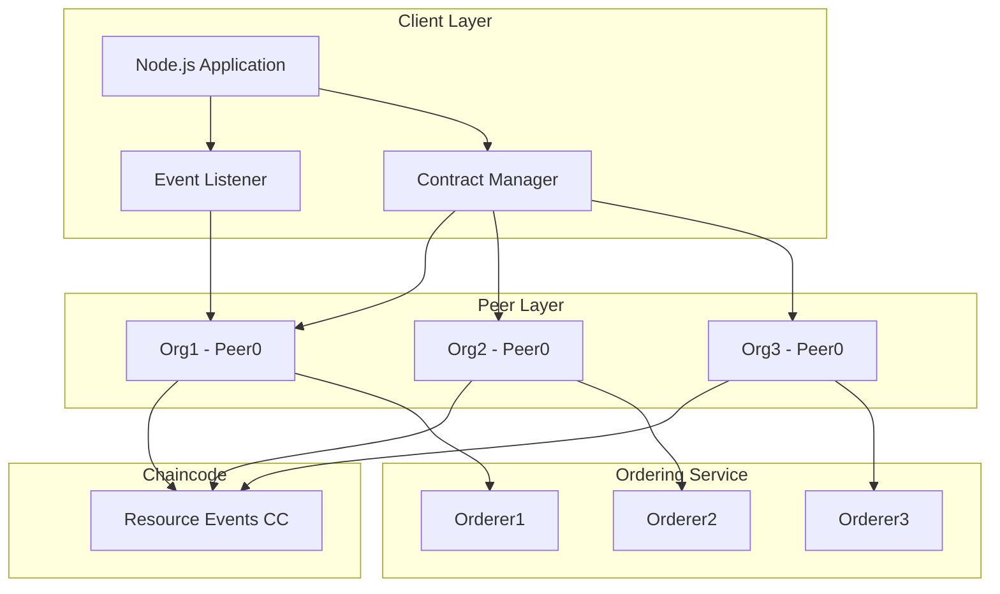

<div align="center">

# 🔗 Hyperledger Fabric Dynamic Network

### *A comprehensive blockchain network implementation with real-time event monitoring and dynamic organization management*

[](https://www.hyperledger.org/use/fabric)
[](https://nodejs.org/)
[](https://www.docker.com/)
[](https://www.typescriptlang.org/)
[](LICENSE)

</div>

---

## 📋 Table of Contents

- [🚀 Getting Started](#-getting-started)
- [🏗️ Architecture](#-architecture)
- [📦 Network Structure](#-network-structure)
- [⚙️ Configuration](#-configuration)
- [🔧 Network Operations](#-network-operations)
- [📊 Performance Testing](#-performance-testing)
- [🔌 Node.js Application](#-nodejs-application)
- [🤝 Contributing](#-contributing)
- [📄 License](#-license)

---

## 🚀 Getting Started

### Prerequisites

Ensure you have the following installed:

| Tool | Version | Purpose |
|------|---------|---------|
| 🐳 [Docker](https://www.docker.com/) | Latest | Container runtime |
| 📦 [Node.js](https://nodejs.org/) | 18+ | Application runtime |
| 🔧 npm | Latest | Package manager |

### Installation

```bash
# Clone the repository
git clone https://github.com/your-username/hlf-events.git
cd hlf-events

# Install Hyperledger Fabric binaries and dependencies
cd network/scripts
./install-requirements.sh

# Package the chaincode
./chaincode-package.sh

# Set up the network (3 orderers + 3 organizations)
./test-3-orgs.sh
```

---

## 🏗️ Architecture



### Network Components

- **3 Ordering Nodes** (Raft consensus)
- **3+ Peer Organizations** (dynamically manageable)
- **1 Channel** (mychannel)
- **JavaScript Chaincode** (resource management)
- **TypeScript Client** (event-driven architecture)

---

## 📦 Network Structure

```
network/
├── 📁 bin/                    # Hyperledger Fabric binaries
├── 📁 channel/                # Generated channel artifacts
├── 📁 compose/                # Docker Compose files
│   ├── docker-compose-ord1.yaml
│   ├── docker-compose-org1.yaml
│   └── ...
├── 📁 config/                 # Core configuration files
│   ├── core.yaml             # Peer configuration
│   └── orderer.yaml          # Orderer configuration
├── 📁 configtx/              # Channel configuration
│   ├── configtx.yaml         # Main channel config
│   └── org4/                 # Dynamic org configs
├── 📁 crypto/                # Crypto config templates
├── 📁 identities/            # Public certificates (shared)
├── 📁 organizations/         # Private keys (local only)
├── 📁 scripts/               # Automation scripts
└── 📁 caliper/               # Performance benchmarking
```

---

## ⚙️ Configuration

### Network Configuration (`network.config`)

Key parameters for customizing your deployment:

```bash
# Fabric Version
FABRIC_VERSION="2.5.13"

# Network Identifiers
NETWORK_CHN_NAME="mychannel"
DEFAULT_ORG_DOMAIN="org1.testbed.local"

# Chaincode Settings
CC_NAME="cc-test"
CC_VERSION="1.0"
CC_SRC_LANG="javascript"
```

### Environment Variables (`.env`)

```bash
FABRIC_DEFAULT_ORGANIZATION=Org1
FABRIC_DEFAULT_USER=User1
FABRIC_DEFAULT_CHANNEL=mychannel
FABRIC_DEFAULT_CC_NAME=cc-test
```

---

## 🔧 Network Operations

All scripts must be executed from the `network/scripts/` directory.

### Initial Network Setup

```bash
cd network/scripts

# 1️⃣ Generate cryptographic material for each organization
./network-prep.sh <crypto-config-file> <docker-compose-file>

# 2️⃣ Generate genesis block (admin only)
./network-init.sh

# 3️⃣ Start Docker containers
./docker-up.sh <docker-compose-file>

# 4️⃣ Join orderers and organizations to the channel
./network-join-orderer.sh <orderer-hostname>
./network-join-organization.sh <org-domain>
```

### Chaincode Lifecycle

```bash
# Install chaincode on organization's peers
./chaincode-install.sh <org-domain>

# Approve chaincode (each organization)
./chaincode-approve.sh <org-domain>

# Commit chaincode to channel (once)
./chaincode-commit.sh <org-domain>

# Test chaincode operations
./chaincode-invoke.sh <org-domain> <peer-id>
./chaincode-query.sh <org-domain> <peer-id>
```

### 🔄 Dynamic Organization Management

#### Adding a New Organization

```bash
# 1️⃣ New org: Generate credentials
./network-prep.sh crypto-config-org4.yaml docker-compose-org4.yaml

# 2️⃣ New org: Start containers
./docker-up.sh docker-compose-org4.yaml

# 3️⃣ Existing org: Create join request
./network-join-request.sh configtx-org4.yaml org1.testbed.local

# 4️⃣ All orgs: Approve join request
./network-approve-update.sh org4_update_in_envelope.pb org1.testbed.local
./network-approve-update.sh org4_update_in_envelope.pb org2.testbed.local

# 5️⃣ Any org: Commit update
./network-commit-update.sh org4_update_in_envelope.pb org1.testbed.local

# 6️⃣ New org: Join channel and set anchor peer
./network-join-organization.sh org4.testbed.local
./network-set-anchor-peer.sh org4.testbed.local 1

# 7️⃣ Install and approve chaincode
./chaincode-install.sh org4.testbed.local
./chaincode-approve.sh org4.testbed.local  # All orgs must approve
./chaincode-commit.sh org1.testbed.local   # Once
```

#### Removing an Organization

```bash
# 1️⃣ Create leave request
./network-leave-request.sh configtx-org4.yaml org4.testbed.local

# 2️⃣ Approve removal (majority required)
./network-approve-update.sh org4_update_in_envelope.pb org1.testbed.local
./network-approve-update.sh org4_update_in_envelope.pb org2.testbed.local

# 3️⃣ Commit removal
./network-commit-update.sh org4_update_in_envelope.pb org1.testbed.local

# 4️⃣ Leaving org: Clean up
./network-leave-organization.sh org4.testbed.local --hard
./docker-down.sh docker-compose-org4.yaml
```

---

## 📊 Performance Testing

Integrated [Hyperledger Caliper](https://hyperledger.github.io/caliper/) for comprehensive benchmarking.

### Available Benchmarks

| Benchmark | Focus | Configuration |
|-----------|-------|---------------|
| 🚀 **Throughput** | Maximum TPS | 4 workers, 60s duration |
| ⏱️ **Latency** | Response time | 1 worker, low TPS |
| ✅ **Success Ratio** | Transaction reliability | 2 workers, mixed load |
| 💻 **Resource Usage** | CPU/Memory/Network | Docker monitoring |

### Running Benchmarks

```bash
cd network/caliper

# Configure network connection
cp networks/network-config.template.yaml networks/network-config.yaml
# Edit network-config.yaml with your organization credentials

# Run a benchmark
./run-benchmark.sh \
    networks/network-config.yaml \
    benchmarks/throughput.yaml

# Results are saved in ./results/
```

### Sample Output

```
+----------------+--------+--------+--------+--------+--------+--------+
| Name           | Succ   | Fail   | Send   | Latency| Latency| Through|
|                |        |        | Rate   | (avg)  | (max)  | put    |
+----------------+--------+--------+--------+--------+--------+--------+
| tx-throughput  | 6000   | 0      | 100.0  | 0.045  | 0.892  | 99.8   |
| query-through. | 12000  | 0      | 200.0  | 0.012  | 0.234  | 199.6  |
+----------------+--------+--------+--------+--------+--------+--------+
```

---

## 🔌 Node.js Application

Event-driven TypeScript application for interacting with the network.

### Setup

```bash
cd node-app

# Install dependencies
npm install

# Configure environment
cp .env.example .env
# Edit .env with your settings

# Build and run
npm run build
npm start
```

### Application Architecture

```typescript
// Key Components
ConnectionManager  → Manages gateway connections
EventManager      → Listens to chaincode events
ContractManager   → Submits transactions
```

### Features

- ✅ **Automatic connection management** with retry logic
- ✅ **Real-time event streaming** from chaincode
- ✅ **Type-safe contract interactions**
- ✅ **Graceful shutdown handling**

### Example Usage

```typescript
// Create a resource
const resource = await contractManager.createResource([
    'pid_123',
    'https://example.com/resource',
    'hash_value',
    '1234567890',
    JSON.stringify(['owner1', 'owner2'])
]);

// Event automatically emitted and logged:
// <-- [CHAINCODE] Chaincode event received: CreateResource
```

---

## 🎯 Chaincode API

### Resource Events Contract

| Function | Type | Description |
|----------|------|-------------|
| `CreateResource` | Submit | Creates a new resource on the ledger |
| `ReadResource` | Evaluate | Retrieves a resource by ID |
| `ReadAllResources` | Evaluate | Returns all resources |

### Resource Schema

```javascript
{
    PID: string,           // Unique identifier
    URI: string,           // Resource location
    hash: string,          // Content hash
    timestamp: string,     // Creation time
    owners: string[]       // List of owner identifiers
}
```

---

## 🛡️ Security Considerations

- 🔐 **Private keys** stored in `organizations/` (never commit)
- 📜 **Public certificates** shared via `identities/` folder
- 🔏 **TLS enabled** for all communications
- ✍️ **Digital signatures** for identity verification
- 🎫 **MSP-based** access control

---

## 🤝 Contributing

This project is part of a master thesis. For questions or suggestions:

1. Open an issue
2. Submit a pull request
3. Contact: [your-email@example.com]

---

## 📚 Additional Resources

- 📖 [Hyperledger Fabric Documentation](https://hyperledger-fabric.readthedocs.io/)
- 🔧 [Fabric Gateway SDK](https://hyperledger.github.io/fabric-gateway/)
- 📊 [Hyperledger Caliper](https://hyperledger.github.io/caliper/)
- 🎓 [Master Thesis Paper](link-to-paper)

---

## 📄 License

This project is licensed under the **GNU General Public License v3** - see the [LICENSE](LICENSE) file for details.

```
Copyright 2025 Matteo Costalonga

Licensed under the Apache License, Version 2.0 (the "License");
you may not use this file except in compliance with the License.
```

---

<div align="center">

### 🌟 If this project helped you, consider giving it a star!

Made with ❤️ for the Hyperledger community

[⬆ Back to Top](#-hyperledger-fabric-dynamic-network)

</div>
