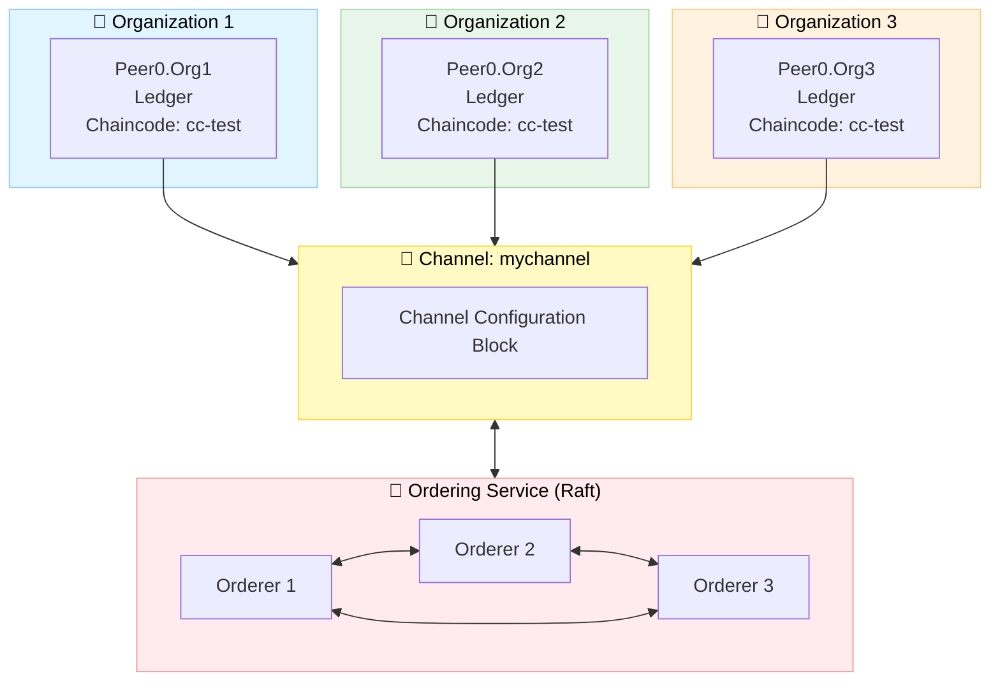

<div align="center">

# 🔗 Hyperledger Fabric Dynamic Network

### *A comprehensive permissioned blockchain network implementation with dynamic organization management, chaincode deployment and real-time event monitoring.*

[![Hyperledger Fabric][fabric-logo]](https://hyperledger-fabric.readthedocs.io/)
[![Node.js][nodejs-logo]](https://nodejs.org/)
[![Docker][docker-logo]](https://www.docker.com/)
[![TypeScript][typescript-logo]](https://www.typescriptlang.org/)
[![License][license-logo]](LICENSE)

</div>

---

## 📋 Table of Contents

* [🚀 Getting Started](#-getting-started)
* [🧩 Project Overview](#-project-overview)
  * [🌐 Network Module](#-network-module)
  * [🧱 Chaincode Module](#-chaincode-module)
  * [💻 Node.js Application Module](#-nodejs-application-module)
* [📚 Additional Resources](#-additional-resources)
* [📄 License](#-license)

---

## 🚀 Getting Started

### Prerequisites

To run this project, ensure that all the following dependencies are installed and available: 

| Tool | Version | Purpose |
|------|---------|---------|
| 🐳 [Docker](https://www.docker.com/) | Latest | Container runtime |
| 📦 [Node.js](https://nodejs.org/) | 18+ | Application runtime |

### Installation

To get started with this project, first clone the repository to your local machine:

```bash
# Clone the repository
git clone https://github.com/wamuumu/hlf-events.git
cd hlf-events
```

---

## 🧩 Project Overview

This project consists of **three main components**, forming a complete blockchain testbed:

| Module             | Description                                                              | Folder       |
| ------------------ | ------------------------------------------------------------------------ | ------------ |
| 🌐 **Network**    | Complete Hyperledger Fabric network with dynamic organization management | `network/`   |
| 🧱 **Chaincode**   | Smart contract defining resource lifecycle operations                    | `chaincode/` |
| 💻 **Node.js App** | Event-driven TypeScript client for invoking and monitoring transactions  | `node-app/`  |

---

## 🌐 Network Module

### 📁 Folder Structure

```
network/
├── 📁 bin/                    # Hyperledger Fabric binaries
├── 📁 channel/                # Generated channel artifacts
├── 📁 compose/                # Docker Compose files
│   ├── docker-compose-ord1.yaml
│   ├── docker-compose-org1.yaml
│   └── ...
├── 📁 config/                 # Core configuration files
│   ├── core.yaml             # Peer configuration
│   └── orderer.yaml          # Orderer configuration
├── 📁 configtx/              # Channel configuration
│   ├── configtx.yaml         # Main channel config
│   └── org4/                 # Dynamic org configs
├── 📁 crypto/                # Crypto config templates
├── 📁 identities/            # Public certificates (shared)
├── 📁 organizations/         # Private keys (local only)
├── 📁 scripts/               # Automation scripts
└── 📁 caliper/               # Performance benchmarking
```

---

### ⚙️ Configuration

### Network Configuration (`network.config`)

 This configuration file contains all the necessary variables for the network definition, including the Hyperledger Fabric settings and the default identity to use.

```bash
# Fabric Version
FABRIC_VERSION="2.5.13"

# Network Identifiers
NETWORK_CHN_NAME="mychannel"
# Paths definitions ...

# Defaults variables
DEFAULT_ORG_DOMAIN="org1.tesbed.local"
DEFAULT_ORD="orderer.ord1.testbed.local"
DEFAULT_PEER_ID=1
DEFAULT_ENDPOINT="localhost"

# Chaincode Settings
CC_NAME="cc-test"
CC_SRC_LANG="javascript"
# Chaincode variables ...
```

---

## 🔧 Network Operations

> [!IMPORTANT]  
> All scripts related to network operations must be executed from the `network/scripts/` directory.

### Initial Network Setup

> [!NOTE]  
> In production, the initial setup might be a little tricky since it requires strict cooperation and coordination among all the initial members of the network. 

> [!IMPORTANT]  
> Before proceeeding, a leader organization should be chosen, ensuring critical operations are executed only once.

```bash
# Install Hyperledger Fabric binaries and dependencies
cd network/scripts
./install-requirements.sh

# 1️⃣ Generate cryptographic material for each organization
./network-prep.sh <crypto-config-file> <docker-compose-file>

# 2️⃣ Generate genesis block (leader only)
./network-init.sh

# 3️⃣ Start Docker containers
./docker-up.sh <docker-compose-file>

# 4️⃣ Join orderers and organizations to the channel
./network-join-orderer.sh <orderer-hostname>
./network-join-organization.sh <org-domain>
```

### Chaincode Lifecycle

```bash
# 1️⃣ Package the chaincode 
./chaincode-package.sh

# 2️⃣ Install chaincode on organization's peers
./chaincode-install.sh <org-domain>

# 3️⃣ Approve chaincode (each organization)
./chaincode-approve.sh <org-domain>

# 4️⃣ Commit chaincode to channel (only once)
./chaincode-commit.sh <org-domain>

# 5️⃣ Test chaincode operations (optional)
./chaincode-invoke.sh <org-domain> <peer-id>
./chaincode-query.sh <org-domain> <peer-id>
```

### 🔄 Dynamic Organization Management

#### Adding a New Organization

```bash
# 1️⃣ New org: Generate credentials
./network-prep.sh crypto-config-org4.yaml docker-compose-org4.yaml

# 2️⃣ New org: Start containers
./docker-up.sh docker-compose-org4.yaml

# 3️⃣ Existing org: Create join request
./network-join-request.sh configtx-org4.yaml org1.testbed.local

# 4️⃣ All orgs: Approve join request
./network-approve-update.sh org4_update_in_envelope.pb org1.testbed.local
./network-approve-update.sh org4_update_in_envelope.pb org2.testbed.local

# 5️⃣ Any org: Commit update
./network-commit-update.sh org4_update_in_envelope.pb org1.testbed.local

# 6️⃣ New org: Join channel and set anchor peer
./network-join-organization.sh org4.testbed.local
./network-set-anchor-peer.sh org4.testbed.local 1

# 7️⃣ Install and approve chaincode
./chaincode-install.sh org4.testbed.local
./chaincode-approve.sh org4.testbed.local  # All orgs must approve
./chaincode-commit.sh org1.testbed.local   # Once
```

#### Removing an Organization

```bash
# 1️⃣ Create leave request
./network-leave-request.sh configtx-org4.yaml org4.testbed.local

# 2️⃣ Approve removal (majority required)
./network-approve-update.sh org4_update_in_envelope.pb org1.testbed.local
./network-approve-update.sh org4_update_in_envelope.pb org2.testbed.local

# 3️⃣ Commit removal
./network-commit-update.sh org4_update_in_envelope.pb org1.testbed.local

# 4️⃣ Leaving org: Clean up
./network-leave-organization.sh org4.testbed.local --hard
./docker-down.sh docker-compose-org4.yaml
```

### Test the network with basic setup

* **3 Ordering Nodes** (`Raft consensus`)
* **3 Peer Organizations**
* **1 Application Channel** (`mychannel`)
* **1 Deployed Chaincode** (`cc-test`)

```bash
# Setup a ready-to-use network with 3 organizations and 3 orderers
./test-3-orgs.sh
```


---

## 🛡️ Security Considerations

- 🔐 **Private keys** stored locally in `organizations/` (never shared)
- 📜 **Public certificates** shared via `identities/` folder (trust)
- 🔏 **TLS enabled** for all communications
- ✍️ **Digital signatures** for identity verification
- 🎫 **MSP-based** access control

---

## 📊 Performance Testing

Integrated [Hyperledger Caliper](https://hyperledger.github.io/caliper/) for comprehensive benchmarking.

### Available Benchmarks

| Benchmark | Focus | Configuration |
|-----------|-------|---------------|
| **Throughput** | Maximum TPS | 4 workers, 60s duration |
| **Latency** | Response time | 1 worker, low TPS |
| **Success Ratio** | Transaction reliability | 2 workers, mixed load |
| **Resource Usage** | CPU/Memory/Network | Docker monitoring |

### Running Benchmarks

```bash
cd network/caliper

# Configure network connection
cp networks/network-config.template.yaml networks/network-config.yaml
# Edit network-config.yaml with your organization credentials

# Run a benchmark
./run-benchmark.sh \
    networks/network-config.yaml \
    benchmarks/throughput.yaml

# Results are saved in ./results/
```

### Sample Output

```
+----------------+--------+--------+--------+--------+--------+--------+
| Name           | Succ   | Fail   | Send   | Latency| Latency| Through|
|                |        |        | Rate   | (avg)  | (max)  | put    |
+----------------+--------+--------+--------+--------+--------+--------+
| tx-throughput  | 6000   | 0      | 100.0  | 0.045  | 0.892  | 99.8   |
| query-through. | 12000  | 0      | 200.0  | 0.012  | 0.234  | 199.6  |
+----------------+--------+--------+--------+--------+--------+--------+
```

---

## 🧱 Chaincode Module

### 📁 Folder Structure

```
chaincode/
└── 📁 cc-test/                  # Chaincode folder
    ├── 📁 lib/                  # Business logic and data model definitions
    │   └── resource.js          # Chaincode source code
    ├── index.js                 # Entry point registering the smart contract
    └── package.json             # Chaincode dependencies and metadata
```

---

### Resource Events Contract

| Function | Type | Description |
|----------|------|-------------|
| `CreateResource` | Submit | Creates a new resource on the ledger |
| `ReadResource` | Evaluate | Retrieves a resource by ID |
| `ReadAllResources` | Evaluate | Returns all resources |

### Resource Schema

```javascript
{
    PID: string,           // Unique identifier
    URI: string,           // Resource location
    hash: string,          // Content hash
    timestamp: string,     // Creation time
    owners: string[]       // List of owner identifiers
}
```

## 💻 Node.js Application Module

Event-driven TypeScript application for interacting with the network.

### 📁 Folder Structure

```
node-app/
├── 📁 config/                  # Connection profiles and environment templates
│   └── connection-org1.json    # Example network connection configuration
├── 📁 src/                     # TypeScript application source code
│   ├── app.ts                  # Main entry point (application bootstrap)
│   ├── connect.ts              # ConnectionManager: gateway and connection management
│   ├── contract.ts             # ContractManager: submit/evaluate transactions
│   └── listener.ts             # EventManager: listens to chaincode and block events
├── package.json                # Project dependencies, scripts and metadata
└── tsconfig.json               # TypeScript compiler configuration

```

### Setup

```bash
cd node-app

# Install dependencies
npm install

# Configure environment
cp .env.example .env
# Edit .env with your settings

# Build and run
npm run build
npm start
```

### Application Architecture

```typescript
// Key Components
ConnectionManager (connect.ts)   →   Manages gateway connections
EventManager (listener.ts)       →   Listens to chaincode events
ContractManager (contract.ts)    →   Submits transactions
```

### Features

- ✅ **Automatic connection management** with retry logic
- ✅ **Real-time event streaming** from chaincode
- ✅ **Type-safe contract interactions**
- ✅ **Graceful shutdown handling**

### Example Usage

```typescript
// In app.ts (main)

// Create a resource
const resource = await contractManager.createResource([
    'pid_123',
    'https://example.com/resource',
    'hash_value',
    '1234567890',
    JSON.stringify(['owner1', 'owner2'])
]);

// Event automatically emitted and logged:
// <-- [CHAINCODE] Chaincode event received: CreateResource
```

---

## 📚 Additional Resources

- 📖 [Hyperledger Fabric Documentation](https://hyperledger-fabric.readthedocs.io/)
- 🔧 [Fabric Gateway SDK](https://hyperledger.github.io/fabric-gateway/)
- 📊 [Hyperledger Caliper](https://hyperledger.github.io/caliper/)

---

## 📄 License

Released under the [GNU](LICENSE) license.

<div align="left">

[](#top)

</div>

<!-- LOGOs -->
[nodejs-logo]: https://img.shields.io/badge/Node.js-18+-green?style=for-the-badge&logo=node.js
[docker-logo]: https://img.shields.io/badge/Docker-Latest-2496ED?style=for-the-badge&logo=docker
[typescript-logo]: https://img.shields.io/badge/TypeScript-5.4-3178C6?style=for-the-badge&logo=typescript
[license-logo]: https://img.shields.io/badge/License-GPL%20v3-yellow?style=for-the-badge
[fabric-logo]: https://img.shields.io/badge/Hyperledger%20Fabric-2.5.13-orange?style=for-the-badge&logo=data:image/png;base64,iVBORw0KGgoAAAANSUhEUgAAAYEAAAF8CAMAAAAei/fRAAAABGdBTUEAALGPC/xhBQAAAAFzUkdCAK7OHOkAAAAJcEhZcwAACxMAAAsTAQCanBgAAABjUExURUdwTJfX15bW2JbW14/Pz5fX15fV1+9QUPFVSvBVSpXX1+9WSu9YSPBVSZXV1/BVSu9UTJbW1+9VSpbW2O9VSvBVSu9US+9WSZXV1ZbW2JbW1vBVSvFWSZbW2JbW1pbW1/BVSg7dr7kAAAAfdFJOUwBA778QIJ8Qn+9ggCC/gN9A32DPMM9wUDCPUK+Pr3BKKEcsAAATK0lEQVR42u1dCWLqOgzMAiFAEkJYupfc/5S/LX2/m0NsaWQ7IB2gBQ9jeySPlCQatxuz1/x02hVzXYlA8ZidzlGkuhhBADh9Ra4YBNiCstNJMQgZzelXbFe6KAEpoBiEp8AnBjNdmnAU+IisUQwCUkAx8Bfb0+kSBrpA0rE6XY5ClygkBd5Db0VhKfB2KdJFCkuB00klsmQ8jgNw0sNYMnJFIGykJ0Ugfgqc7nWdwlJA70KC8WKDgOoBuZgrBQJHoRSYLgW6p2W/fOp0EeUpYLyKLg79OTaKgTQFMlOBYLHp/w/FgB4PZAo89d9juV7oYlJisDg5SoF9/ysUA1I0ZAqU/Z9YPle6ohIUOJnekVa9MUrFQIAChSUFFANCoCnwEU+tLqxtrPAU+IhaMbCMLZUCi2V/Oeo7XV1RCqz70VCRhqJASqGAYoCjQE6kwBmDo4q0S7GTpYAK5bFIyRQ49g6hGAxGTqVAsundQkUanQLGykzXO4diQKXACkGBMwYq0n7FvU8KqFA2ROGXAorB76DX59ueEQcVaXwKlD0rVCg7UMBYnEzqvudioAKB80QlOfTsUJGWzOgU4HNAMUg49Xn2OaBV/Q8KZHQK8O5CKpQdKDDoIC57xYAb5Pr8RywOOAhuVKSlLAq8xXqpGLBixaLABw2wGNwpAu59JLAY3JpQttmFxp2Ti26jGMidxLnV38FicEsi7YFWnDRhgLwX3ZBQnu0gFDgLtFoxoKRGd8A+KlAMbkakzZoMQ4EzBiWSB7dyN529boHm4QqJwf52dMEW6J8HYrC5JW22BfrncSLtprRBmgNbSKAwKG9MIefAFhKLNUKk1TeXK/3R3mbH/GsAoXxzCLzpg6/K/Y7f4ZiNQZkkt4vBA6TF9B1PpN2oB2322DQprMU3RyhvEo2wGOirOlQQRZpSIDQGa103KAbPriJtaU5Q3zdN86qj6nwIZSMF7j/T6YX2nRXHwEiB1XWMSbtbr9eBHo47VPVNFJhn1zCqrt2ErUHZYmD6ifx+a7+bYvfTLnwd0Kqqb0pIzK9hVN3PB89loCqUhUirLCgwyVF1dSSPNccwsKTA9MaktfE8mN2XEApMDYM6JmfpBaFsosDs8qi62VQpAH2smb68XRcze7U0iIGJlyN2k91sshTAOUsf3G/qZpFmqo2NOq52EwBgL/tQsCCpJRMGBApMY0RRKfpY89db+Nz6pr44bgAUmMJ4kErWWZoz1NIPobw0qZRXrt1nAhRgCuX0xFKsXxiY34vatINMJ08BFgY595b4WdU3/3sry1t6DRQgi7QUcFOv2rYdOIqsOqJGDsDCpT7ijkF+SS2xN2grCrxEjsDarUbo6Cy93CUne2V++O0VbEIL57e0TkJ5rEvOA+vD2wztdbabRE4BRwzmsj/Q/CYp4OQsLUR/ofSmwEl1rOu6jOH147EnhpVQnsvKJXpH1OMyGp844xWzBQYPopsEvSlwGY9X/07UWWrVKIqOAHlo711EHuVnUXdvI3pQ0juibiLyiQO81mseBTJI0tuJAp1pRw3lE38CmLqeWRQoRCmQ2f/sAr3RWQMQ6FsGBehXIXJH1DaqfgkVAoEnRs5GmAIzt503xKg6xDbUM3I2ZAo8wCkQ6I0OpC9i658C9I6oNTz9y4WgFkJANm1JbgpcgVOPEFXGxqCiUiAXpYBxi7OqR3nHgNmCyeis24WnQMG4engfVcfC4IhNW9qELAXCCGV6+x+jrUg2c7+SpsC0MFhTKUB/TriVp8AZA98izd1ZyqLASpQCL5h6lG8MCC2YyBTYylIgRSVhfBuKnDGwcdYFoECOK8l6F2lu/aJdbEUgCuy8UiCMUHbAoPJOAfpFl9PkrvYt0mz7RZMpkJGtLeSLLrMkG6lQJlOgEaXAVqQYEiMGzs46TxRYCZWjDr4LyvsxBbNHpi2tgj60F1IQ9A7BiFAm2oo4FGCc8h0AgRDtpS5h0FIpQH6wy7noLhANf5eQRX0sdqe8YDpLORQQrs8PvYmXfJfgVN3IQe5eOgUC1OcpiTkhBL7/SBnO0vdTCZq2tIpX5ikP6DzORyCHOEuH2n7K1uetNqGLpzy/+zsbgRTl7jW335algJUYaODpX+xJnCOcpYM3Y9n6vBUHxi+6ph3V3210znWW/hPKzwto5h6XmC5IOyqz2SngR+TgLN0fB1syijvrLO66c+KpFpQCnz+eucQWB3bWNbhTnvQ+RIwCmNkCqTQFLE4Cl5+ROwalJAUA/ahk6/P/JEEGvOi6jqqrZCnANVgL1+f/PwsujKo7Obeddnqjw6YA7hxDU6A6Pj+t7d29Q6PqSFucAwZsCjRsOSOTtlyUzjWoAQxop3xlKdJ8UEBYLZkp8M3D4PBQ8DEHfno7odx6oAADAToFauJjzb/jAhkXXYtRdbUPCjAQgDnrHJylP0fVcS+6YyKNTYEVdYmEM/c157Hmt1F1jNKnFQb8QYCTctYRMMgRzXW7OjAFInLW2TtL5695nj+g2ggNCeWDHwqQ5+iQn6jsY3KWXsKg80KB2Jx1oTAwiLSNHwrE56zbxNKBn/05puusC4fBEnoRmrKzzruz9K9Q5j9WnLizLlQLpk8MloCnihE460wUsH9HGKwN1r5tET6ya3DWLUONSYPElTjrpovB9TjrQo2qi5sCqS8KBBVp8hSg9zwkX3SJ/X4niEGszjry28G6u0YK+HfWcUxFMKE8e33J80Z4VFCszjpehzsMBk3mambxmrkXPuXZjq418gmhIAbROusArjomBj+FTP4YkALCzrqVEALMUXV/tLzMYO94nXUIbylLKBu0vAQG2/AUGDjly74Pi4FxabbogcbC9XnORbdaoiCg9YteDZpZZtOhAO+i2/W4IAjl4aXJgAJB2FnHvOjeLZEYOA5WehQ1s/Az97hzuBivQYHCTaTlomYWTxRI+Vscy1nKwSCVWxZI2hKXkRg/5TsoBrZV/ZyoYjxl7oHngM2ZBsXATihbLM2LLwpwtHiBuui2tWcMLJYm80QBlrNunsEuulAMRkWa1R3CEwVWoke9yxbXlv4wKLwgMBenwDvPtsBTvsJisOAtzY6NQCFPgQ8abIGnPBSD4aeGrF5pfijQurwUG8aAcNGtgCKtDlO35actP5XqhucsJV90gUJ5IFlEdlx5ytx/2XtZzlLGFmfhLLXMmYao27Ip8GNGHN1ZyjzlMSJtI5DRhRYnjTivIc5SrtYDYRCgbsvG2fCUkIhBwf0OXS3CAdm6rRvOJgocmc7Sfy9weI1yQEL5KXIKGHHecGtQs+btUN4WoCoTD4M773VbPs4drAaFCoZI2/iv2/Jx3kzBWWobXTAK0HHupuAsladAGicFYnGWylMg90MB6rSiwM5SJgV28VDAiLPdxSMYBm4iLcDQXjbObfSuRgcMAgzt5ePscveOHoMAE0vZOLdu+2woZ6mdSAswtNcJZ2MF7mkqrkYbDGKngAnninDlDobBqEjzP7SXjzNNeR7iFMoBhvayca7I2ZcYMaiCUWDumQJgDOarpnm1bjc4LNICDO1l47wI7Sx9T+kWrs7SIQz8D+3l48wcn4zAYPYlJR1G1Zmq+gGG9vJx5s9s5DlLf2t5zqi6AEN7AThDpmayhPKK7iz9hQG5OMmnAAPnu74PjMGW4yz9NqrO/Foxovr8AM6LHhRPLYYCrs7S/4VyvYDWbfEUGHrD8BzSWTqs5R2cpW1Z13XZ0pcmYH3+gwSHHoeBe1X/gpZHvLuIvT4Ph8BdpF1MZ7Ex8FSfL7g4d5tgGIyks7L7KVDAKitawGpQQGepxWfP5uIUABiIcwTOAZylVlo+F6cAoMlWg8HZu7PUbgNlkODREwVsLO52OPt1llqms1aym8MJ0mcuh+Hs01lqeYegp2xSXxSwEAQOOIOdpS07o9vIUgDU3my+A+KMxaCumNfoR1EKbBNUXHL3On8JpLO0X+4l0lkW8eKRAmfIcyDOyBZMywqf0RWt2+IxIOEMc5YOeUsZjivZui0PgxckzjCRtgiQtgxBgfM/LpA4gzBo8RldwbotHAMezh1CpK39py09PVEZ+u9NBtR8AKHc+U9bPoSjwJnh/2OQAc4aNgZ77xTwVJ+/jMH7bywD2Xt5Ii2As64JTIF/NyMgxhwM/DvrPNXnPUf1vARSYBeeAkUyuSAK5QDOuqukABmDAM661ZVS4IyBs0gj24oCDO2dSLhhEMBZd9UU+MTg4IECAYb2ui7D06Gv43aWhnHWeXqiUh0m4CwN46zz00Li+zSdeJ2lQZx1nurz9RScpWGcdX6eqLRTaYPl31nnqT5fmx7MRtj+J4Czzs8TlVa6/c8sTdM5AAP/zrr7YBRAYnD/gnCW9uYe6NEO7XWJvaCz9P0+nUGcpQP14WiH9rpEKdqC6R7m7iVTgJ6zsVJj7BEPo604eBjkEGcpiwL0nE0jusXZUYAr0lKIs/Q9ngOkLRvJU96aAjwMcqaztL4IgHTachUJBRj9olO2q/GjT+5y4Nm6dOZ+5oECDh54ilDORd298mnLQp4CTp04nDG4KGhe7rkfXj5zP9vJbXGfFHBtAewm0grRe5wPZ90YBHOvFHAWynNZNeknbXnRzOKdAo4YFJKnpD9n3QUM2BQ4irb/mQvmCxLO0N5z4unAHlUHqM/T3/PbYGCR1toJU8CYs9kv3XdUs6GIfZfo5JyltjkbYQqsLgHQu42qy8WLk+gWTFY5G/Jnp6ctD9S01x9DEf+JimgbLCsK0Hchcua+Y6Qef2IAGJUGcBQ98yjwEJwCdjvq1/99yJDP5BC2uiOHAgGcdS039fhpKNpCnKsIW92Qwfo1UmddDUj/3juUvQXvQiMkiNRZ10bW/R3RlK+mpy0DOOvqyDrwVwCL9YZOAbKgIT9R2SOb2kFiwW89c/Cfuaef8iU29YihQSmxC0VgLi3IJdmpYdB5T1uKUuCMge8xaWRn6cScdS4zcnxjQG/BNCVnnRvZfRuKiBhMyVnnXI/ybWZZUNr/TMlZR5gP4t1Q5IzBckLOOlJJtq99i7TOTSZPyVlHHZHjXSg7tf+ZkLNuQb/vRYwB3VknW5w0UeDIET3eRdq+FKZAAGcdMxUfp1CO1Vxq3OLYPWdjxGBSzjpAIv7g2186JtKm5axD1EIO3is4lzGYlrMO0gI+QBVtcdzAKSBcnx+46Lb9JElwSSj7d9bxTnnItMAkiQcDemUmVOfbcroI/HWWctp+0l86bZmnPKDzeBIufgvljX8KJPyLLheDZRIy2idI82fGg2PERZeHQZmEjS+RtryDZu4tI4NscZzO41WSBMdgOVzIFjeXokbukTEokxhi3+7RaUtcWq4g7agTooBM5h54HZ0TdlT7eIobAIazDrYPFW47qisC7RVQgN0N6XELvOg6jqqrI6eAr4Fdjzlwi3N6oxM5Bawq6GYKVM9vmeP6yHSWEk95ewxip0BCpsCa4Cx9QZ7yliLtLnYEtkQKPGOcpayLrg0Gm9gBsJldamErYmDAuuiOj6rrokdgRcvZ/PnmTxRnKcBfPSKU46eAxVFs66xzdpaCrlkXMegmgMB9BnPWuWOQp4ivMPxOagoUeINgh3PWOTwUTJvm9R71HYaE8jqZRqwuZSZMFCjjcvd+pX9t3ohHmpvIcbYi787SYZG2TiYUQxhQbEXeHwoOYDAhCpzPgwLnrAuGwQ+RdpdMLQyKleys8+4s/SOUl10ywZgX2bizLlZn6Q+hvCmrZJrxXS2dtrMLKbkInaVXEl8Y7EwAuNmK6lYXlILB67tIG5hA4+qsUwzQtw13U0vd6bIBg+Ss2ygGuCC+HlQMYDe96TjqlAJiGMya94vCy+NNArDvWYEYVZekmfuYtBs/h7FC+Z42qu5aYt33oTHYUkfVKQcoVf2/sWKMqtNzACGUt6fTbWNQ9ygM7jAUwI1Jm0i0PSxIIm0rOaru2iUZAoNL78uK9FZYsEFi4FjVv2w3ebmV86BDYuAklMfsJrubOZLbOgwGo46rhyRRDARFWgqyxV4LBqV3DCxMh6/JLUWFxWC0qm/TJadIEsVATCgX4sbnSWKwXvrCwKpR1ENye7HAYrBgUeB0iyWDf1NrQTHYmlK4I6qKtP/jmUOBJrndwGFgvpcKd0S9DgxAIs2crmuUAt6E8ppMgdMsSRQDIQRkO6KqSBtFQLgpsGIw2hp+pRRwxIAh0kJ0RFWhHLgpsGKAocC9LvpvDEgijUyBXFccIpTpFEh1uSEYHA1/I1UK+BNpAYb2Kgajakx4aO+NYFBKU2CliwwRygGG9ioGoxTQ4iQQgzGRFmBorwrl0eqYUgCOwQZPgUzXFSPS/A/tVQxAFNDipHsYRtUFGNqrQnl0ToA+UfGIwZJMgQddSohI66gU0OIkBIOD0TygT1S8YNCt1+sB84bW5wOH1udDh1JgChTQ4qRg7LQ4GTZmSoHAkSoFJoCAUiD0LvSoyxT2JNbiZOjbqBYnheNFKRD6JCiUAqHjcacUCH4nzbU4GSsGWpz0F8ZRdUoBr2EYVacUCI2BUsD/3fT7qDrzrDoNfxhs1bp6w/EfjPLaNiDxCXMAAAAASUVORK5CYII=

